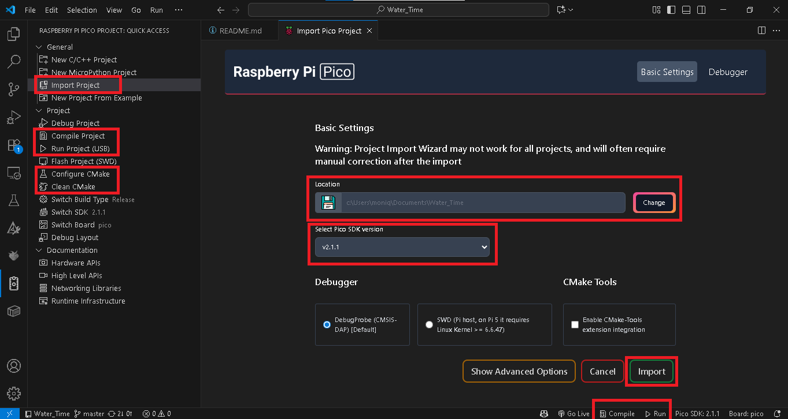

# Water_Time 🚰🌱

Mini temporizador inteligente para irrigação, desenvolvido em **C com FreeRTOS-LTS** para o **Raspberry Pi Pico (RP2040)**.  
O sistema simula um controlador de irrigação com botões, sensores e acionamento temporizado.

---

## 📋 Requisitos

- [Raspberry Pi Pico SDK](https://github.com/raspberrypi/pico-sdk)
- [CMake](https://cmake.org/download/) (>= 3.13)
- [ARM GCC Toolchain](https://developer.arm.com/downloads/-/arm-gnu-toolchain-downloads)
- **Git** (para clonar o projeto e submódulos)
- **Visual Studio Code** com extensões:
  - *C/C++*
  - *CMake Tools*
  - *Raspberry Pi Pico Project*

---

## ⚙️ Instalação do Pico SDK

Você pode instalar a SDK tanto pelo **VSCode** quanto pelo **terminal**.

### 🔹 Pelo VSCode
1. Instale a extensão [**Raspberry Pi Pico**].
2. Com a extensão será baixada outras extensões com cmake, python e outro, necessária para projeto funcionar.

### 🔹 Pelo Terminal (Linux / WSL / macOS)
```
# Baixe as bibliotecas necessárias:
sudo apt install cmake python3 build-essential gcc-arm-none-eabi libnewlib-arm-none-eabi libstdc++-arm-none-eabi-newlib -y

# Clone o SDK para o projeto
git clone -b master https://github.com/raspberrypi/pico-sdk.git
cd pico-sdk
git submodule update --init --recursive

# Adicionar o caminho do patch
export PICO_SDK_PATH=$HOME/pico-sdk

```

Para mais detalhes, consulte o repositório oficial da SDK do Raspberry Pi Pico: https://github.com/raspberrypi/pico-sdk/tree/master?tab=readme-ov-file

## ⬇️ Clonando o Repositório

Este projeto usa o **FreeRTOS-LTS como submódulo**.  
Por isso, é importante clonar com a opção `--recurse-submodules`:

```bash
git clone --recurse-submodules https://github.com/MoniqueMoreira/Water_Time.git
cd water_time
```

Se você já clonou sem essa opção, rode:

```bash
git submodule update --init --recursive
```

---

## 🛠️ Compilando o Projeto

### Pelo VSCode
1. Abra a extensão do Raspberry Pi Pico instalada anteriormente.  
2. Selecione **“Importar Projeto”**.  
3. Escolha o diretório onde o repositório foi clonado.  
4. Na seleção de versão, escolha **2.1.1** (a versão 2.2.0 apresenta problemas).  
5. Clique em **“Importar”**.  
6. Aguarde o projeto ser carregado completamente e configure o CMake.  
7. Compile o projeto e faça o upload para o microcontrolador **RP2040 (Raspberry Pi Pico 2020)**.  

   > ⚠️ Atenção:  
   > - Se a placa estiver zerada, será necessário usar o botão **BOOTSEL** para colocá-la em modo de boot.  
   > - Caso já tenha feito esse processo ao menos uma vez, também é possível reiniciar em modo boot pelo terminal com o comando:  
   >   ```bash
   >   picotool reboot -u -f
   >   ```




### Pelo Terminal
```bash
mkdir build
cd build
cmake ..
make -j4
```

Isso vai gerar um `.uf2` dentro da pasta `build/`.

---

## 🚀 Gravando no Pico

1. Conecte o Raspberry Pi Pico no PC **segurando o botão BOOTSEL**.
2. Monte a unidade USB que aparece.
3. Copie o arquivo `.uf2` para dentro dela.

Pronto! Seu Pico está rodando o **Water_Time** 🎉

---
